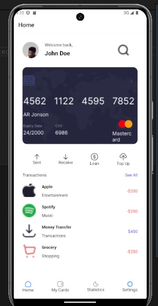
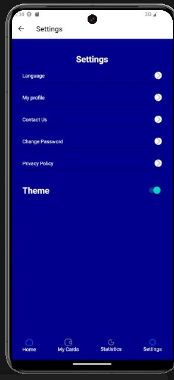
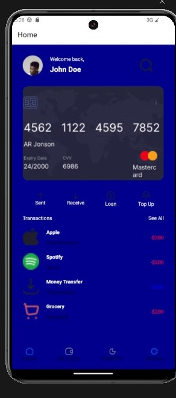
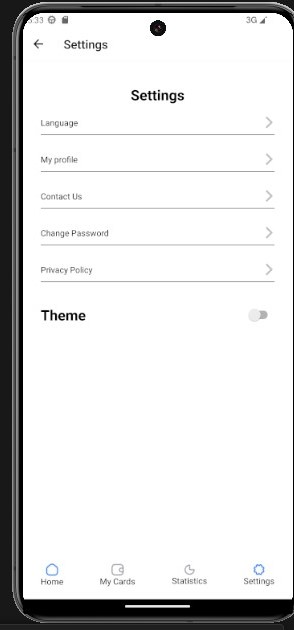

# rn-assignment5-11288153

# Overview

This is a brief react native app iwth 2 screens, the home and the settings screen, in the setting screen.
The user can alternate between light and dark themes in this React Native application, which showcases a basic theme toggling functionality. The Home and Settings screens are among the displays that retain the theme selection.

# Features

Home page: Offers access to the Settings page and a welcome message.
Toggle between light and dark themes on the Settings screen.
Global Theme Context: Oversees and implements theme modifications for every screen in the program.

# How it Works

App.js
The program makes use of a custom ThemeContext to manage theme state and React Navigation for screen navigation.To give theme context to all screens, the ThemeProvider component encapsulates the NavigationContainer.

Theme.js
Context and Provider: ThemeProvider, which controls theme state (isEnabled, backgroundColor, color), is used to generate ThemeContext. It also offers a toggleSwitch function. React's createContext is used to accomplish this.

# Installation

- git clone https://github.com/koadipah/rn-assignment5-11288153.git
- cd Dev
- npm install

# SCREENSHOTS

